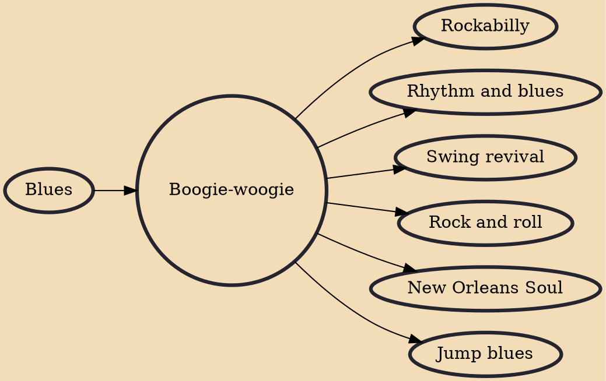

Boogie-woogie is a genre of blues music that became popular during the late 1920s, developed in African-American communities since 1870s. It was eventually extended from piano, to piano duo and trio, guitar, big band, country and western music, and gospel. While standard blues traditionally expresses a variety of emotions, boogie-woogie is mainly associated with dancing (although not the competitive dance known as boogie-woogie, a term of convenience in that sport). The genre had a significant influence on rhythm and blues and rock and roll.

## Influences
- [[Blues]]

## Derivatives
- [[Rockabilly]]
- [[Rhythm and blues]]
- [[Swing revival]]
- [[Rock and roll]]
- [[New Orleans Soul]]
- [[Jump blues]]
