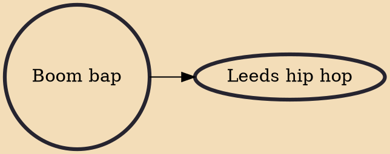

Boom bap is a subgenre and music production style that was prominent in the East Coast during the golden age of hip hop from the late 1980s to the early 1990s. The term "boom bap" is an onomatopoeia that represents the sounds used for the bass (kick) drum and snare drum, respectively. The style is usually recognized by a main drum loop that uses a hard-hitting, acoustic bass drum sample on the downbeats, a snappy acoustic snare drum sample on the upbeats, and an "in your face" audio mix emphasizing the drum loop, and the kick-snare combination in particular.

## Derivatives
- [[Leeds hip hop]]
