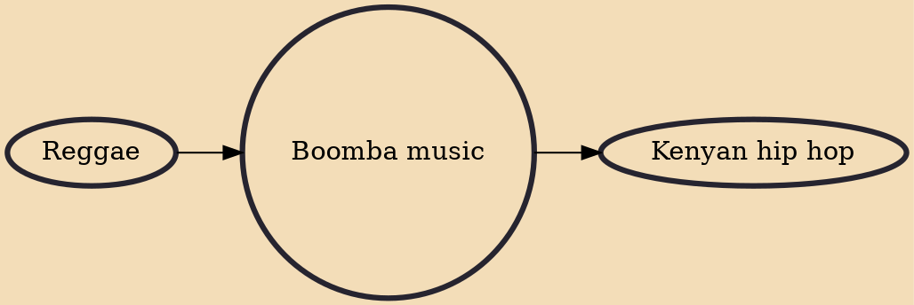

Boomba music, also referred to as kapuka (due to the beat pattern; not to be confused with kapuka rap), is a form of hip pop music popular in Kenya. It incorporates hip hop, reggae and African traditional musical styles. The lyrics are in Swahili, Sheng or local dialects. It is associated with the Ogopa Deejays and is believed to have originated in the late 1990s with artists such as Redsan, Bebe Cool and Chameleone. It went on to dominate East African airwaves (especially Kenya and Uganda) after the release of the Ogopa Deejays' first album in 2001, which included artists such as the late E-Sir, Nameless, Mr. Lenny, Amani, Mr. Googz and Vinnie Banton amongst others.

## Influences
- [[Reggae]]

## Derivatives
- [[Kenyan hip hop]]
