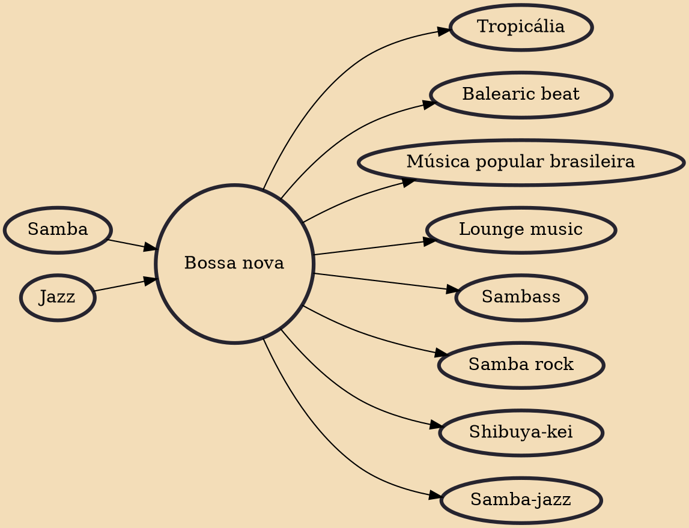

Bossa nova (Portuguese pronunciation: [ˈbɔsɐ ˈnɔvɐ]) is a style of samba developed in the late 1950s and early 1960s in Rio de Janeiro, Brazil. It is mainly characterized by a "different beat" that altered the harmonies with the introduction of unconventional chords and an innovative syncopation of traditional samba from a single rhythmic division. The "bossa nova beat" is characteristic of a samba style and not of an autonomous genre.

## Influences

- [[Samba]]
- [[Jazz]]

## Derivatives

- [[Tropicália]]
- [[Balearic beat]]
- [[Música popular brasileira]]
- [[Lounge music]]
- [[Sambass]]
- [[Samba rock]]
- [[Shibuya-kei]]
- [[Samba-jazz]]
