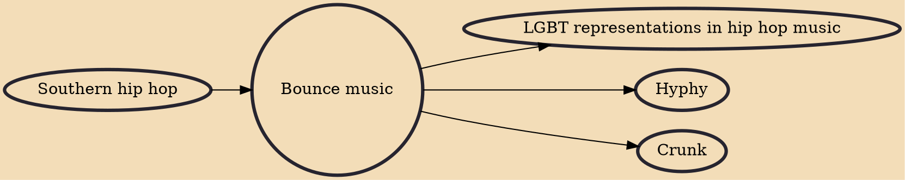

Bounce music is a style of New Orleans hip hop music that is said to have originated as early as the late 1980s in the city's housing projects. Popular bounce artists have included DJ Jubilee, Partners-N-Crime, Magnolia Shorty and Big Freedia.

## Influences
- [[Southern hip hop]]

## Derivatives
- [[LGBT representations in hip hop music]]
- [[Hyphy]]
- [[Crunk]]
