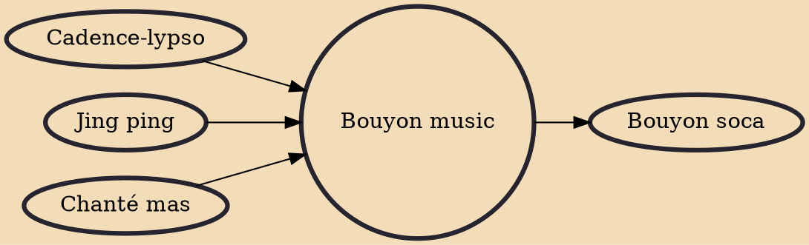

Bouyon (pronunciation: boo-yon) is a genre of Dominican music that originated in Dominica in the late 1980s mainly with the group "WCK", with names such as Derek "Rah" Peters on vocals, Cornell Phillips keys and vocals among others, while bands such as the "Triple Kay" are very popular with "Carlyn XP" being the undisputed MCs for having won numerous contests. Dominican singers such as "Asa Banton", "Suppa", "Benz Mr Gwada", "Reo" and "Gaza Girl" became popular years later.

## Influences
- [[Cadence-lypso]]
- [[Jing ping]]
- [[Chanté mas]]

## Derivatives
- [[Bouyon soca]]
