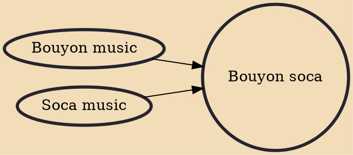

Bouyon soca is a fusion-genre of bouyon music originating from Dominica and soca music originating from Trinidad & Tobago and the other English speaking Caribbean islands. Bouyon soca typically blends old bouyon music rhythms from the 90s' and soca music creating a unique style soca sound. The style of music was made more popular to the Caribbean region by the likes of the producer Dada and artists ASA from Dominica with collaborations from Trinidadian and St.Vincent artist such as Skinny Fabulous, Bunji Garlin, Iwer George and Machel Montano. Noticeable hits includes Famalay and Conch Shell. With noticeable Bouyon flavored rhythms and sounds with the essence of Soca tempo and lyrical attributes.

## Influences

- [[Bouyon music]]
- [[Soca music]]
