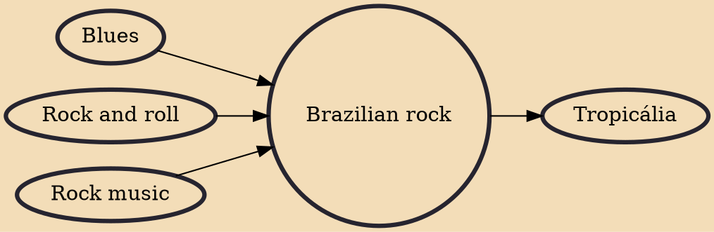

Brazilian rock refers to rock music produced in Brazil and usually sung in Portuguese. In the 1960s it was known as iê-iê-iê, from the Portuguese transcription of the line "Yeah, yeah, yeah" from the Beatles song "She Loves You".

## Influences

- [[Blues]]
- [[Rock and roll]]
- [[Rock music]]

## Derivatives

- [[Tropicália]]
