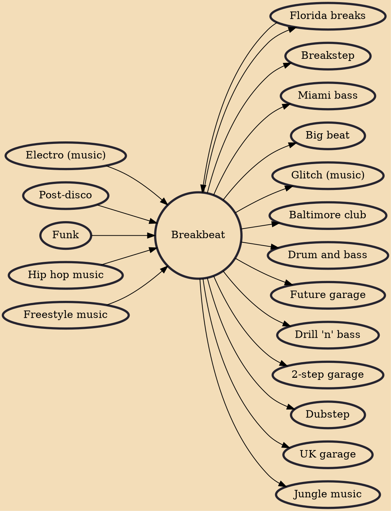

Breakbeat is a broad type of electronic music that tends to use drum breaks sampled from early recordings of funk, jazz, and R&B. Breakbeats have been used in styles such as hip hop, jungle, drum and bass, big beat, breakbeat hardcore, and UK garage styles (including 2-step, breakstep and dubstep).

## Influences

- [[Electro (music)]]
- [[Post-disco]]
- [[Funk]]
- [[Florida breaks]]
- [[Hip hop music]]
- [[Freestyle music]]

## Derivatives

- [[Breakstep]]
- [[Miami bass]]
- [[Big beat]]
- [[Glitch (music)]]
- [[Baltimore club]]
- [[Drum and bass]]
- [[Future garage]]
- [[Florida breaks]]
- [[Drill 'n' bass]]
- [[2-step garage]]
- [[Dubstep]]
- [[UK garage]]
- [[Jungle music]]
