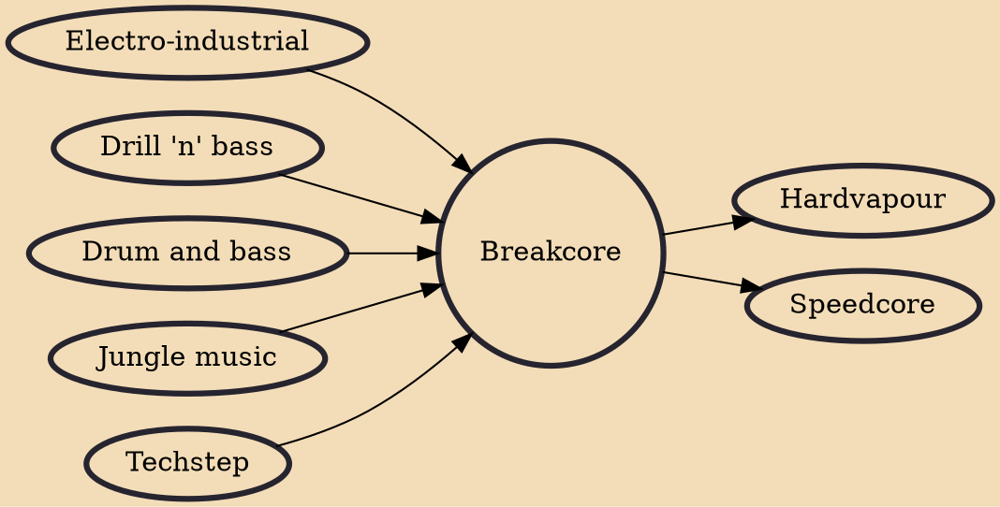

Breakcore is a style and microgenre of electronic dance music that emerged from jungle, hardcore, and drum and bass in the mid-to-late 1990s. It is characterized by very complex and intricate breakbeats and a wide palette of sampling sources played at high tempos.

## Influences

- [[Electro-industrial]]
- [[Drill 'n' bass]]
- [[Drum and bass]]
- [[Jungle music]]
- [[Techstep]]

## Derivatives

- [[Hardvapour]]
- [[Speedcore]]
