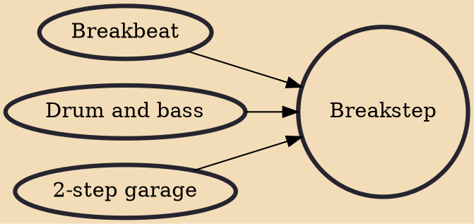

Breakstep, or breakbeat garage, is a genre of music that evolved from the UK garage scene and influenced the emergence of dubstep.

## Influences

- [[Breakbeat]]
- [[Drum and bass]]
- [[2-step garage]]
