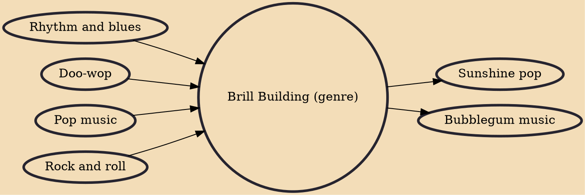

Brill Building (also known as Brill Building pop or the Brill Building sound) is a subgenre of pop music that took its name from the Brill Building in New York City, where numerous teams of professional songwriters penned material for girl groups and teen idols during the early 1960s. The term has also become a metonym for the period in which those songwriting teams flourished. In actuality, most hits of the mid-1950s and early 1960s were written elsewhere.

## Influences

- [[Rhythm and blues]]
- [[Doo-wop]]
- [[Pop music]]
- [[Rock and roll]]

## Derivatives

- [[Sunshine pop]]
- [[Bubblegum music]]
