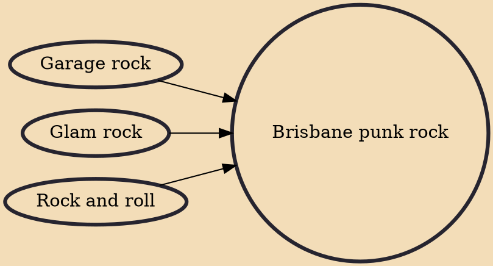

Brisbane punk rock had its main impact between 1975 and 1984 as part of the overall punk rock scene in Australia. According to rock music historian, Ian McFarlane, the Queensland capital provided "some of the most anarchistic bands" of that era whilst it was "arguably the most conservative city" in the country. The development of the local punk movement differed from other cities because of its relative geographic isolation from other similar trends. The Brisbane scene also received a greater scrutiny by local police where early punk bands formed as "an obvious backlash to an oppressed society". This generated antagonistic and individualistic groups or "snot" driven punk bands.

## Influences
- [[Garage rock]]
- [[Glam rock]]
- [[Rock and roll]]
