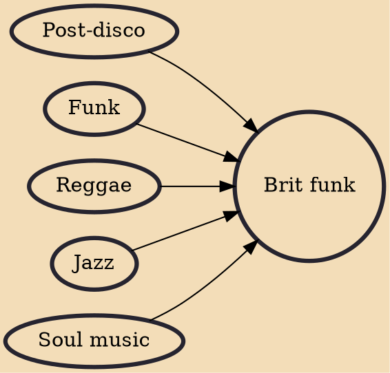

Brit funk (or Britfunk) is a musical style that has its origins in the British music scene of the late 1970s and which remained popular into the 1980s. It mixes elements from jazz, funk, soul, urban dance rhythms and pop hooks. The scene originated in southern England and spread with support from DJs including DJ Froggy, Greg Edwards, Robbie Vincent, Chris Hill and Colin Curtis. Major funk acts included Jimmy James and the Vagabonds, Average White Band, Ian Dury & the Blockheads, Carl Douglas, Hot Chocolate, the Delegation, Hi-Tension, Light of the World, Level 42, Central Line, the Pasadenas, Beggar and Co and Soul II Soul. The genre also influenced 1980s new wave/pop groups such as Culture Club, Bow Wow Wow, Pigbag, Dexys Midnight Runners and Haircut 100.

## Influences
- [[Post-disco]]
- [[Funk]]
- [[Reggae]]
- [[Jazz]]
- [[Soul music]]
