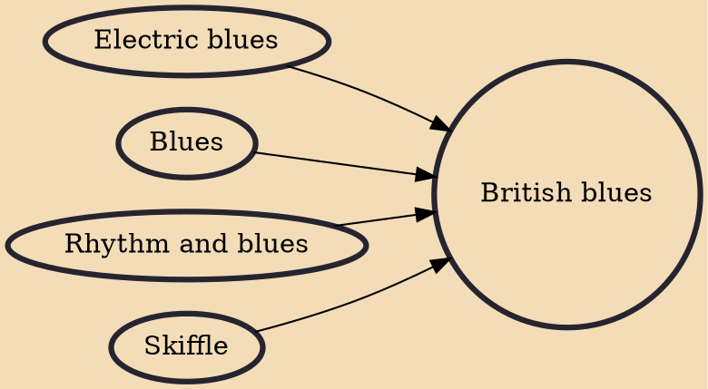

British blues is a form of music derived from American blues that originated in the late 1950s, and reached its height of mainstream popularity in the 1960s. In Britain, it developed a distinctive and influential style dominated by electric guitar and made international stars of several proponents of the genre including the Rolling Stones, the Animals, Eric Clapton, Fleetwood Mac and Led Zeppelin.

## Influences

- [[Electric blues]]
- [[Blues]]
- [[Rhythm and blues]]
- [[Skiffle]]
