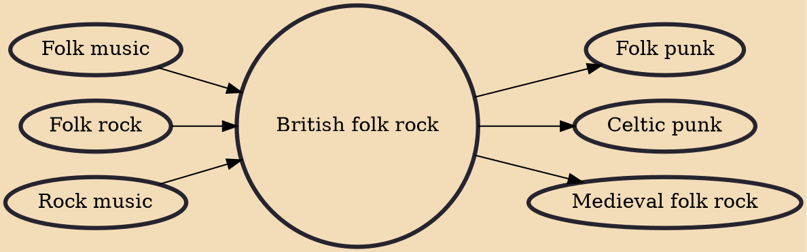

British folk rock is a form of folk rock which developed in the United Kingdom from the mid 1960s, and was at its most significant in the 1970s. Though the merging of folk and rock music came from several sources, it is widely regarded that the success of "The House of the Rising Sun" by British band the Animals in 1964 was a catalyst, prompting Bob Dylan to "go electric", in which, like the Animals, he brought folk and rock music together, from which other musicians followed. In the same year, the Beatles began incorporating overt folk influences into their music, most noticeably on their Beatles for Sale album. The Beatles and other British Invasion bands, in turn, influenced the American band the Byrds, who released their recording of Dylan's "Mr. Tambourine Man" in April 1965, setting

## Influences

- [[Folk music]]
- [[Folk rock]]
- [[Rock music]]

## Derivatives

- [[Folk punk]]
- [[Celtic punk]]
- [[Medieval folk rock]]
