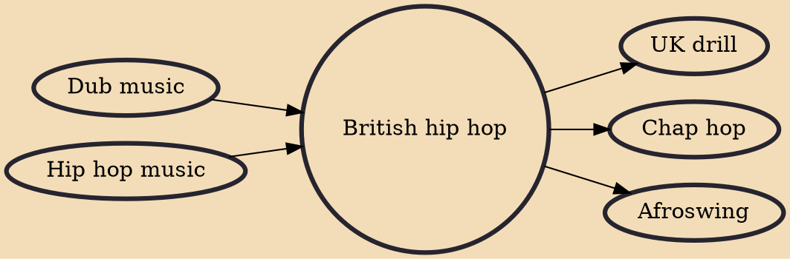

British hip hop, also known as UK hip hop or UK rap, is a genre of music, and a culture that covers a variety of styles of hip hop music made in the United Kingdom. It is generally classified as one of a number of styles of R&B/Hip-Hop. British hip hop can also be referred to as Brit-hop, a term coined and popularised mainly by British Vogue magazine and the BBC. British hip hop was originally influenced by the dub/toasting introduced to the United Kingdom by Jamaican migrants in the 1950s–70s, who eventually developed uniquely influenced rapping (or speed-toasting) in order to match the rhythm of the ever-increasing pace and aggression of Jamaican-influenced dub in the UK. Toasting and soundsystem cultures were also influential in genres outside of hip hop that still included rapping – su

## Influences
- [[Dub music]]
- [[Hip hop music]]

## Derivatives
- [[UK drill]]
- [[Chap hop]]
- [[Afroswing]]
