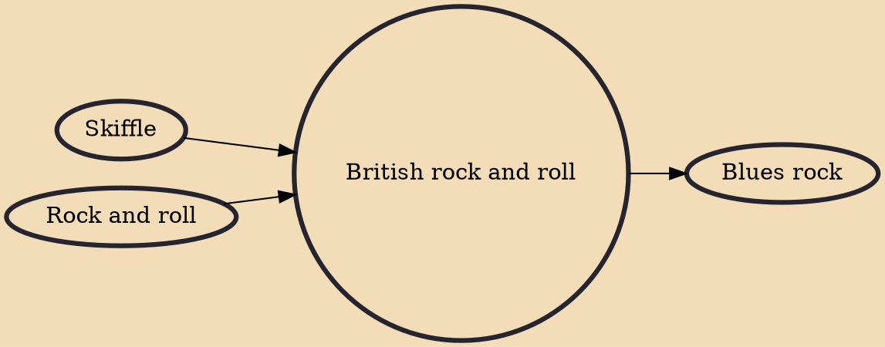

British rock and roll, or sometimes British rock 'n' roll, is a style of popular music based on American rock and roll, which emerged in the late 1950s and was popular until the arrival of beat music in 1962. It was important in establishing British youth and popular music culture and was a key factor in subsequent developments that led to the British Invasion of the mid-1960s. Since the 1960s, some stars of the genre, most notably Cliff Richard, have managed to sustain successful careers and there have been periodic revivals of this form of music.

## Influences

- [[Skiffle]]
- [[Rock and roll]]

## Derivatives

- [[Blues rock]]
