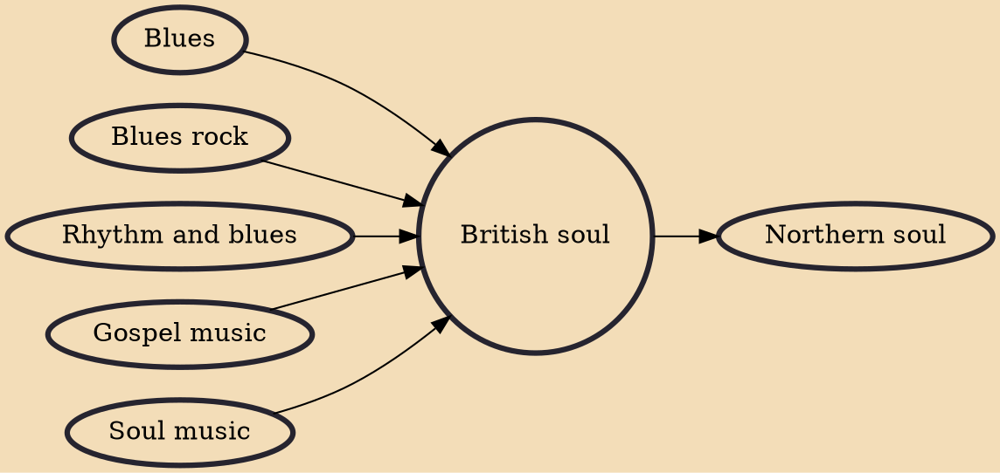

British soul, Brit soul, or (in a US context) the British soul invasion, is soul music performed by British artists. Soul has been a major influence on British popular music since the 1960s, and American soul was extremely popular among some youth subcultures, such as mods, skinheads, and the Northern soul movement. In the 1970s, soul gained more mainstream popularity in the UK during the disco era.

## Influences

- [[Blues]]
- [[Blues rock]]
- [[Rhythm and blues]]
- [[Gospel music]]
- [[Soul music]]

## Derivatives

- [[Northern soul]]
