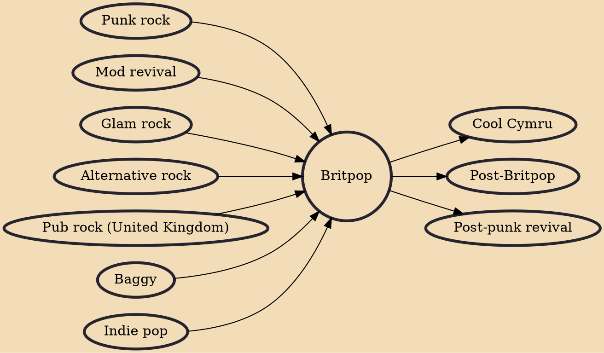

Britpop was a mid-1990s British-based music culture movement that emphasised Britishness. It produced brighter, catchier alternative rock, partly in reaction to the popularity of the darker lyrical themes of the US-led grunge music and to the UK's own shoegaze music scene. The movement brought British alternative rock into the mainstream and formed the backbone of a larger British popular cultural movement, Cool Britannia, which evoked the Swinging Sixties and the British guitar pop of that decade.

## Influences

- [[Punk rock]]
- [[Mod revival]]
- [[Glam rock]]
- [[Alternative rock]]
- [[Pub rock (United Kingdom)]]
- [[Baggy]]
- [[Indie pop]]

## Derivatives

- [[Cool Cymru]]
- [[Post-Britpop]]
- [[Post-punk revival]]
