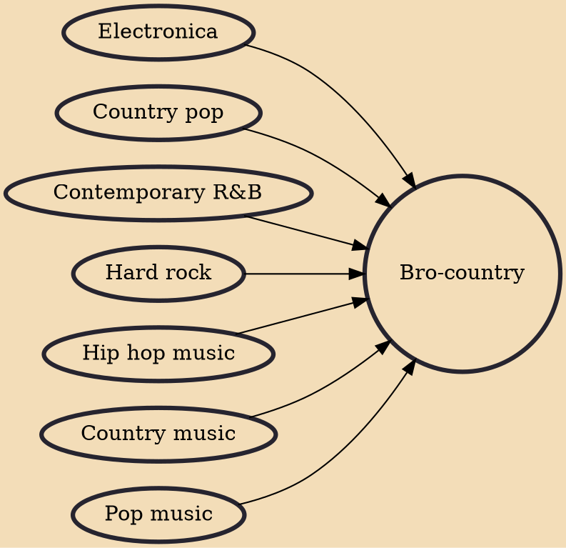

Bro-country is a form of country pop originating in the 2010s, and is influenced by 21st-century hip hop, hard rock and electronica. Bro-country songs are often musically upbeat with lyrics about attractive young girls, the consumption of alcohol, partying, and pickup trucks.

## Influences

- [[Electronica]]
- [[Country pop]]
- [[Contemporary R&B]]
- [[Hard rock]]
- [[Hip hop music]]
- [[Country music]]
- [[Pop music]]
