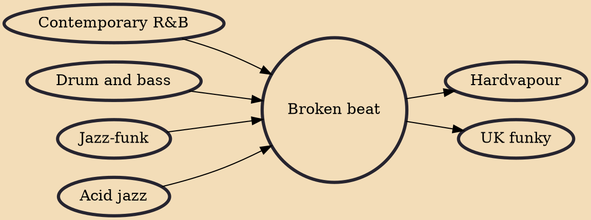

Broken beat (sometimes referred to as "bruk") is an electronic dance music genre characterized by syncopated beats and tense rhythms, including staggered or punctuated snare beats and/or hand claps. It has been heavily influenced by styles such as jazz-funk and R&B. Artists in this area typically emerged from drum and bass, house, hip hop, techno or acid jazz scenes.

## Influences

- [[Contemporary R&B]]
- [[Drum and bass]]
- [[Jazz-funk]]
- [[Acid jazz]]

## Derivatives

- [[Hardvapour]]
- [[UK funky]]
