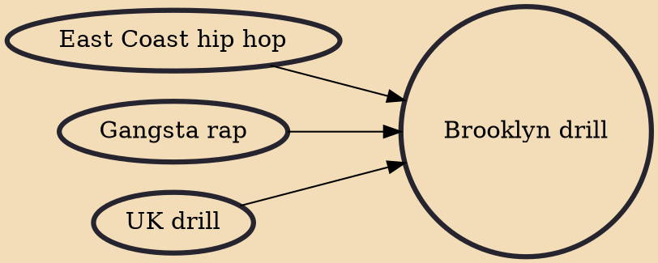

Brooklyn drill is a regional subgenre of drill music, centered in Brooklyn, New York, that began as derivative of the drill music scene in Chicago and later became derivative of UK drill with its 808 percussion and sliding notes by producers from the UK drill scene. Brooklyn drill emerged around 2014 with the single "Hot Nigga" from the rapper Bobby Shmurda. Other early pioneers were rappers Rowdy Rebel, Bam Bino, Money Millz, Dah Dah and Curly Savv. It was again made popular in the mainstream in 2019 by the late Pop Smoke. With the success of his mixtapes Meet the Woo (2019) and Meet the Woo 2 (2020), Pop Smoke introduced Brooklyn drill into the mainstream music industry. Other notable Brooklyn drill artists include Fivio Foreign, 22Gz, Sheff G, Sleepy Hallow, and Dusty Locane.

## Influences

- [[East Coast hip hop]]
- [[Gangsta rap]]
- [[UK drill]]
