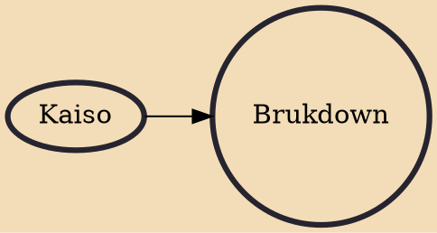

Brukdown is a genre of Belizean music. Its best-known performer and innovator, Wilfred Peters is regarded as a Belizean national icon. The word brukdown may come from broken down calypso, referring to the similarities between brukdown and Trinidadian calypso music; the presence of large numbers of Jamaicans in Belize also led to an influence from mento music.

## Influences
- [[Kaiso]]
