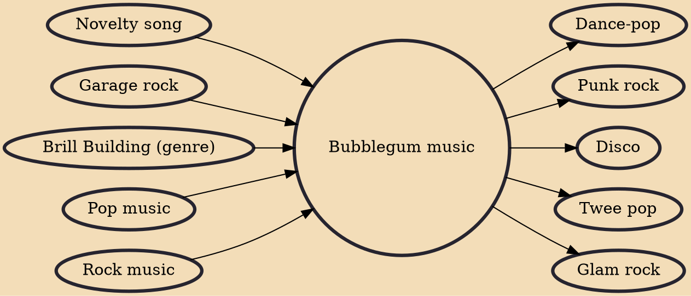

Bubblegum (also called bubblegum pop) is pop music in a catchy and upbeat style that is considered disposable, contrived, or marketed for children and adolescents. The term also refers to a rock and pop subgenre, originating in the United States in the late 1960s, that evolved from garage rock, novelty songs, and the Brill Building sound, and which was also defined by its target demographic of preteens and young teenagers. The Archies' 1969 hit "Sugar, Sugar" was a representative example that led to cartoon rock, a short-lived trend of Saturday-morning cartoon series that heavily featured pop rock songs in the bubblegum vein.

## Influences
- [[Novelty song]]
- [[Garage rock]]
- [[Brill Building (genre)]]
- [[Pop music]]
- [[Rock music]]

## Derivatives
- [[Dance-pop]]
- [[Punk rock]]
- [[Disco]]
- [[Twee pop]]
- [[Glam rock]]
