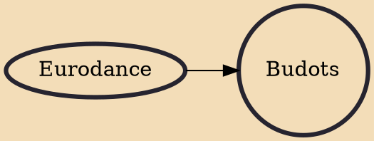

Budots (/buˈdɔːts/; boo-DOTS) is a grassroots electronic dance music (EDM) genre that originated in Davao City, Philippines, and is considered as street style hiphop. It eventually spread in Bisaya-speaking regions. Based on house music and indigenous Badjao beats, it is regarded as the first "Filipino-fied" electronic music, characterized by its heavy use of percussion, hypnotic bass, high-pitched "tiw ti-ti-tiw" whistle hooks, and organic noises that surround the city. It is created to complement a form of freestyle street dance that bears the same name.

## Influences
- [[Eurodance]]
