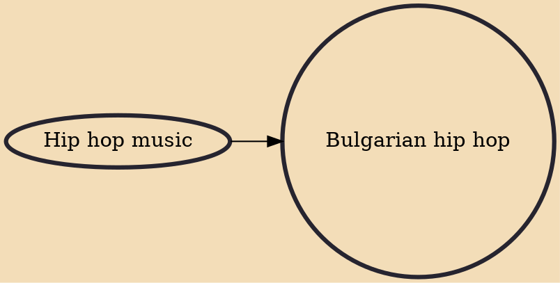

```dot
digraph {
	graph [bgcolor="#F3DDB8" rankdir=LR]
	node [color="#26242F" penwidth=3.0]
	"Bulgarian hip hop" [shape=circle]
	"Hip hop music" [URL="/hip-hop-music/"]
	"Hip hop music" -> "Bulgarian hip hop"
}
```

Hip hop is one of the most popular music styles in Bulgaria, especially among young people.

## Influences

- [[Hip hop music]]
