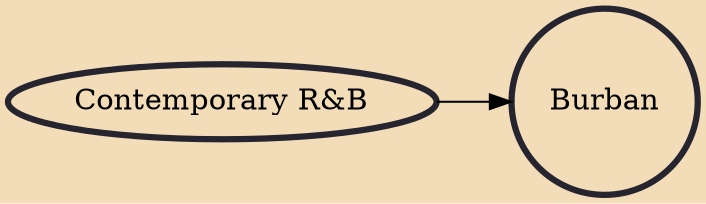

Burban (portmanteau of "brown urban") is a musical sub-culture and an attempt to unify urban musicians of Asian descent. The idea has caused a split amongst the bigger artists and critics due to the ambiguity of the term itself. The common misconception of burban is that it is a musical genre of Asian origin, which is incorrect. Burban is a sub-culture of hip hop/R&B music, focused on artists of Asian background. The reason behind this was to abolish the term "urban desi", which commonly pigeon-holed hip hop artists as 'desi' artists.

## Influences
- [[Contemporary R&B]]
