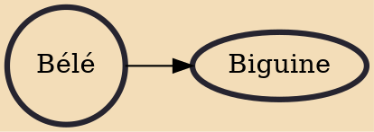

A bélé is a folk dance and music from Martinique, St. Lucia, Dominica, Haiti, Grenada, Guadeloupe, and Trinidad and Tobago. It may be the oldest Creole dance of the creole French West Indian Islands, and it strongly reflects influences from African fertility dances. It is performed most commonly during full moon evenings, or sometimes during funeral wakes (Antillean Creole: lavèyé). The dance is also popular in Saint Lucia. In Tobago, it is thought to have been performed by women of the planter class at social events in the planters' great houses, and the dress and dance style copied by the enslaved people who worked in or around these houses [1].

## Derivatives

- [[Biguine]]
