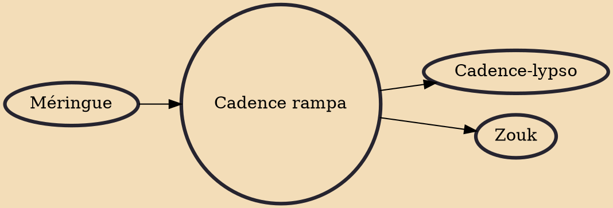

Cadence rampa (Haitian Creole: kadans ranpa, [kadãs ɣãpa]), or simply kadans, is a dance music and modern méringue popularized in the Caribbean by the virtuoso Haitian sax player Webert Sicot in the early 1960s. Cadence rampa was one of the sources of cadence-lypso.Cadence and compas are two names for the same Haitian modern meringue.

## Influences
- [[Méringue]]

## Derivatives
- [[Cadence-lypso]]
- [[Zouk]]
