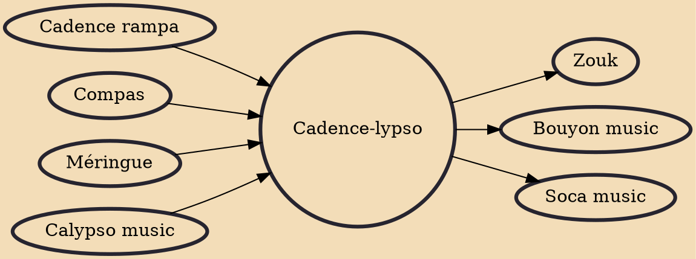

Cadence-lypso is a fusion of cadence rampa from Haiti and calypso from Trinidad and Tobago that has also spread to other English speaking countries of the Caribbean. Originated in the 1970s by the Dominican band Exile One on the island of Guadeloupe, it spread and became popular in the dance clubs around the Creole world and Africa as well as the French Antilles. Gordon Henderson is the leader and founder of Exile One, and the one who coined the term cadence-lypso.

## Influences
- [[Cadence rampa]]
- [[Compas]]
- [[Méringue]]
- [[Calypso music]]

## Derivatives
- [[Zouk]]
- [[Bouyon music]]
- [[Soca music]]
