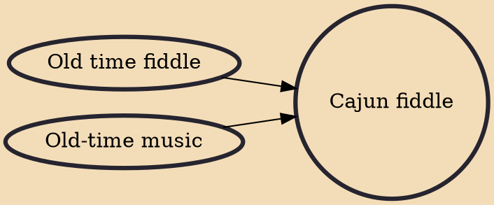

Cajun fiddle music is a part of the American fiddle music canon. It is derived from the music of southwest Louisiana and southeast Texas, as well as sharing repertoire from the Quebec and Cape Breton Island traditions. It is one of the few extant North American folk music traditions rooted in French chanson.According to Ron Yule, "Louisiana fiddling had its birth roots in Europe, with fiddling being noted as early as the 1400s in Scotland". Zydeco music is a geographically, culturally, and musically related style.

## Influences
- [[Old time fiddle]]
- [[Old-time music]]
