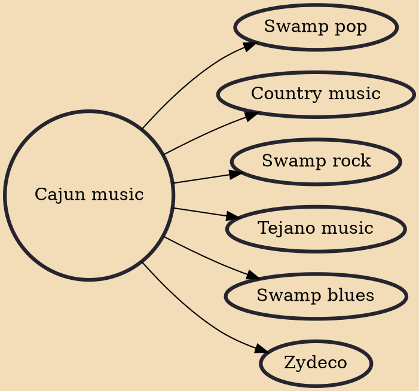

Cajun music (French: Musique cadienne), an emblematic music of Louisiana played by the Cajuns, is rooted in the ballads of the French-speaking Acadians of Canada. Although they are two separate genres, Cajun music is often mentioned in tandem with the Creole-based zydeco music. Both are from southwest Louisiana and share French and African origins. These French Louisiana sounds have influenced American popular music for many decades, especially country music, and have influenced pop culture through mass media, such as television commercials.

## Derivatives
- [[Swamp pop]]
- [[Country music]]
- [[Swamp rock]]
- [[Tejano music]]
- [[Swamp blues]]
- [[Zydeco]]
