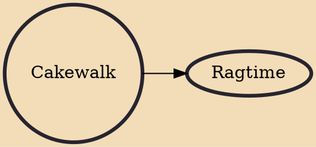

The cakewalk was a dance developed from the "prize walks" (dance contests with a cake awarded as the prize) held in the mid-19th century, generally at get-togethers on Black slave plantations before and after emancipation in the Southern United States. Alternative names for the original form of the dance were "chalkline-walk", and the "walk-around". It was originally a processional partner dance danced with comical formality, and may have developed as a subtle mockery of the mannered dances of white slaveholders.

## Derivatives
- [[Ragtime]]
