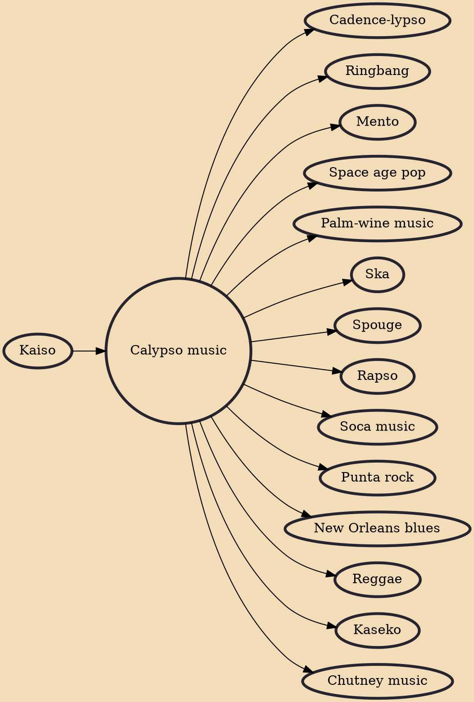

Calypso is a style of Caribbean music that originated in Trinidad and Tobago during the early to the mid-19th century and spread to the rest of the Caribbean Antilles and Venezuela by the mid-20th century. Its rhythms can be traced back to West African Kaiso and the arrival of French planters and their slaves from the French Antilles in the 18th century.

## Influences

- [[Kaiso]]

## Derivatives

- [[Cadence-lypso]]
- [[Ringbang]]
- [[Mento]]
- [[Space age pop]]
- [[Palm-wine music]]
- [[Ska]]
- [[Spouge]]
- [[Rapso]]
- [[Soca music]]
- [[Punta rock]]
- [[New Orleans blues]]
- [[Reggae]]
- [[Kaseko]]
- [[Chutney music]]
