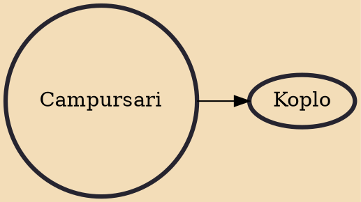

Campursari in Indonesian refers to a crossover of several contemporary Indonesian music genres, mainly Javanese Langgam Jawa and Dangdut. The word campursari was coined from the Javanese language, and literally means "mixture of essences". Campursari music is popular and prevalent within the Javanese cultural sphere, especially Central Java, Special Region of Yogyakarta and East Java; and also in some regions where Javanese immigrants were abundant, such as parts of Greater Jakarta, Lampung or even Suriname. It is related to the modification of several musical instruments like gamelan combined with western musical instruments such as guitar and keyboard. The combination thus ends up with the western instruments to be dominated by the traditional Javanese instruments according to the local

## Derivatives
- [[Koplo]]
