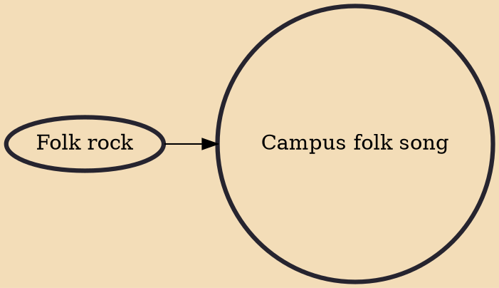

Taiwan campus folk song, campus folk song, or campus folk rock (Chinese: 校園民歌) is a genre of Taiwanese Music with its roots as student songs in the campuses of Taiwanese universities during the 1970s. The genre was highly popular from the mid-1970s to the early 1990, with its focus on themes from the Chinese cultural sphere in reaction to the prevalence of Western rock music in Taiwan as well as being edged out by the People's Republic of China from the United Nations and from the world political stage. This genre of music became very popular in mainland China during the 1990s with the increased cultural exchanges between Taiwan and the mainland during this period.

## Influences

- [[Folk rock]]
