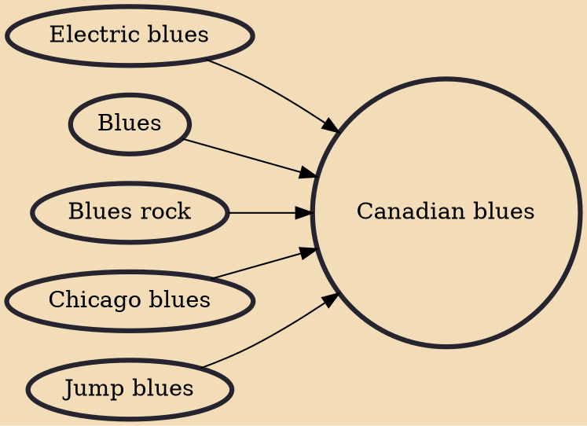

Canadian blues is the blues and blues-related music (e.g., blues rock) performed by blues bands and performers in Canada. Canadian blues artists include singers, players of the main blues instruments: guitar (acoustic and electric), harmonica ("blues harp"), keyboards (piano and Hammond organ), bass and drums, songwriters and music producers. In many cases, blues artists take on multiple roles. For example, the Canadian blues artist Steve Marriner is a singer, harmonica player, guitarist, songwriter and record producer.

## Influences

- [[Electric blues]]
- [[Blues]]
- [[Blues rock]]
- [[Chicago blues]]
- [[Jump blues]]
