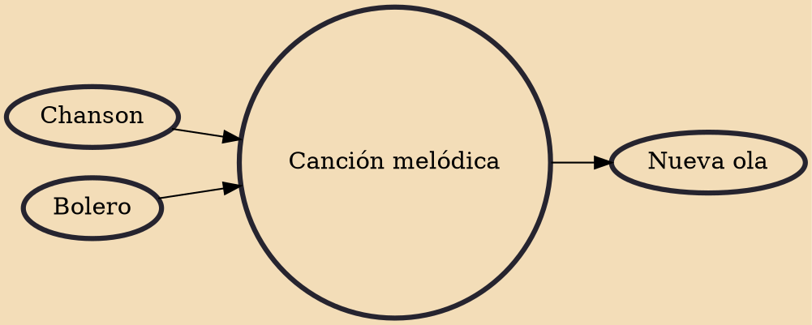

Canción melódica (pronounced [kanˈθjon meˈloðika]; Spanish for "melodic song"), also known as canción ligera ("light song") is a genre of Spanish-language popular music typically defined by sentimental ballads with light, orchestral arrangements. It grew out of traditional forms Latin music such as bolero, cuplé and copla, and later incorporated strong influences of French chanson and the Italian pop popularized in the Sanremo Music Festival.

## Influences

- [[Chanson]]
- [[Bolero]]

## Derivatives

- [[Nueva ola]]
