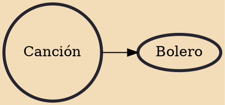

Canción ("song") is a popular genre of Latin American music, particularly in Cuba, where many of the compositions originate. Its roots lie in Spanish popular song forms, including tiranas, polos and boleros; also in Italian light operetta, French romanza, and the slow waltz. Initially, even when written by the creole population of Cuba, who opposed the ruling hierarchy, the music retained its European style of "intricate melodies, and dark, enigmatic and elaborate lyrics".

## Derivatives

- [[Bolero]]
