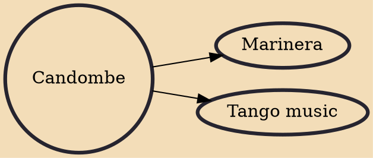

Candombe is a style of music and dance that originated in Uruguay among the descendants of liberated African slaves. In 2009, the United Nations Educational, Scientific and Cultural Organization (UNESCO) inscribed candombe in its Representative List of the Intangible Cultural Heritage of Humanity. This Uruguayan music style is based on three different drums: chico, repique, and piano drums. It is usually played in February during carnival in Montevideo at dance parades called llamadas and desfile inaugural del carnaval.

## Derivatives
- [[Marinera]]
- [[Tango music]]
