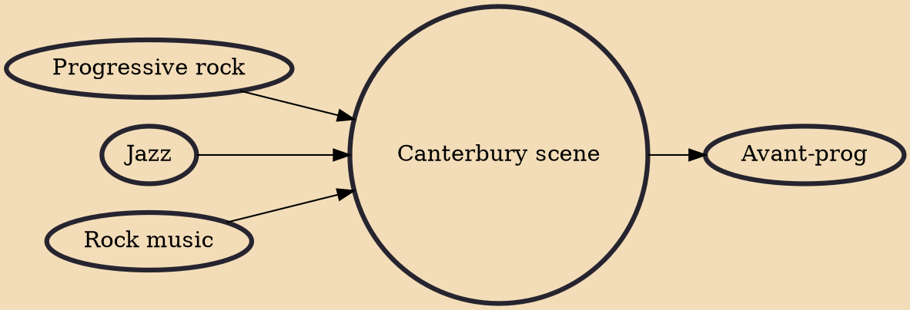

The Canterbury scene (or Canterbury sound) was a musical scene centred on the city of Canterbury, Kent, England during the late 1960s and early 1970s. Associated with progressive rock, the term describes a loosely-defined, improvisational style that blended elements of jazz, rock, and psychedelia.

## Influences
- [[Progressive rock]]
- [[Jazz]]
- [[Rock music]]

## Derivatives
- [[Avant-prog]]
