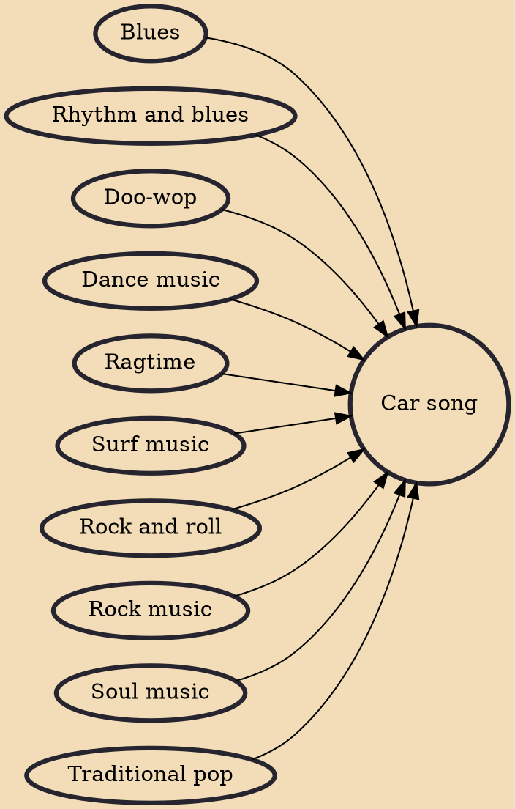

A car song is a song with lyrics or musical themes pertaining to car travel. Though the earliest forms appeared in the 1900s, car songs emerged in full during the 1950s as part of rock and roll and car culture, but achieved their peak popularity in the West Coast of the United States during the 1960s with the emergence of hot rod rock as an outgrowth of the surf music scene. Though this popularity declined by the late 1960s, cars remain a frequently used subject matter in pop music into the 21st century.

## Influences

- [[Blues]]
- [[Rhythm and blues]]
- [[Doo-wop]]
- [[Dance music]]
- [[Ragtime]]
- [[Surf music]]
- [[Rock and roll]]
- [[Rock music]]
- [[Soul music]]
- [[Traditional pop]]
