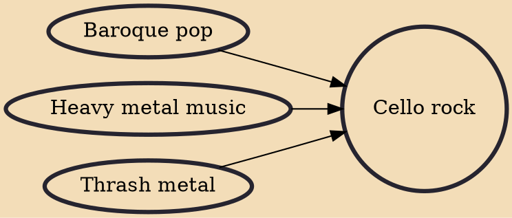

Cello rock and cello metal are subgenres of rock music characterized by the use of cellos (as well as other bowed string instruments such as the violin and viola) as primary instruments, alongside or in place of more traditional rock instruments such as electric guitars, electric bass guitar, and drum set.

## Influences
- [[Baroque pop]]
- [[Heavy metal music]]
- [[Thrash metal]]
