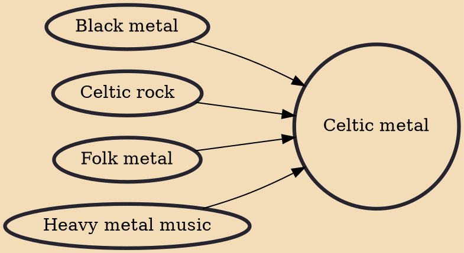

Celtic metal is a subgenre of folk metal that developed in the 1990s in Ireland. The genre is a fusion of heavy metal and Celtic rock. The early pioneers of the genre were the Irish bands Cruachan, Primordial and Waylander. The genre has since expanded beyond Irish shores and is known to be performed today by bands from numerous other countries.

## Influences
- [[Black metal]]
- [[Celtic rock]]
- [[Folk metal]]
- [[Heavy metal music]]
