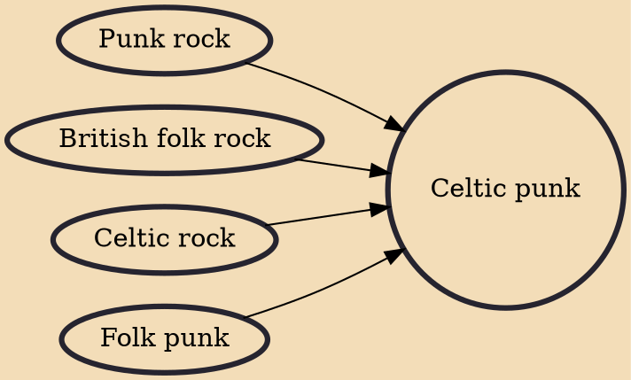

Celtic punk is punk rock mixed with traditional Celtic music. Celtic punk bands often play traditional Irish, Welsh or Scottish folk and political songs, as well as original compositions. Common themes in Celtic punk music include politics, Celtic culture and identity, heritage, religion, drinking and working class pride. The genre was popularized in the 1980s by The Pogues. The typical Celtic punk band includes rock instrumentation as well as traditional instruments such as bagpipes, fiddle, tin whistle, accordion, mandolin, and banjo. Like Celtic rock, Celtic punk is a form of Celtic fusion.

## Influences

- [[Punk rock]]
- [[British folk rock]]
- [[Celtic rock]]
- [[Folk punk]]
