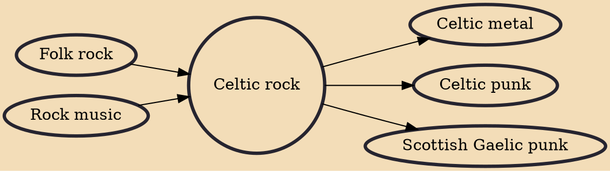

Celtic rock is a genre of folk rock, as well as a form of Celtic fusion which incorporates Celtic music, instrumentation and themes into a rock music context. It has been extremely prolific since the early 1970s and can be seen as a key foundation of the development of highly successful mainstream Celtic bands and popular musical performers, as well as creating important derivatives through further fusions. It has played a major role in the maintenance and definition of regional and national identities and in fostering a pan-Celtic culture. It has also helped to communicate those cultures to external audiences.

## Influences

- [[Folk rock]]
- [[Rock music]]

## Derivatives

- [[Celtic metal]]
- [[Celtic punk]]
- [[Scottish Gaelic punk]]
