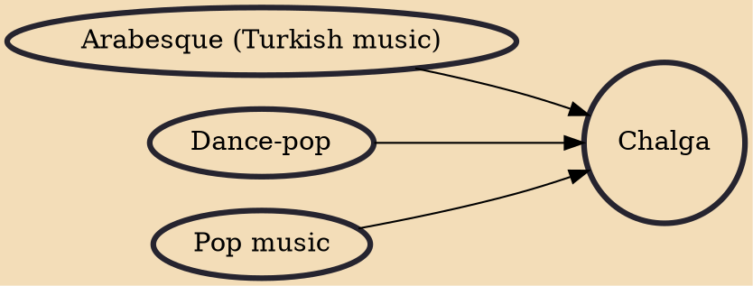

Chalga (Bulgarian: чалга; often referred to as pop-folk, short for "popular folk" or ethno-pop, short for "ethnic pop") is a Bulgarian music genre. Chalga or pop-folk is essentially a folk-inspired dance music genre, with a blend of Bulgarian music (Bulgarian ethno-pop genre) and also primary influences from Greek, Turkish and Arabic.

## Influences
- [[Arabesque (Turkish music)]]
- [[Dance-pop]]
- [[Pop music]]
