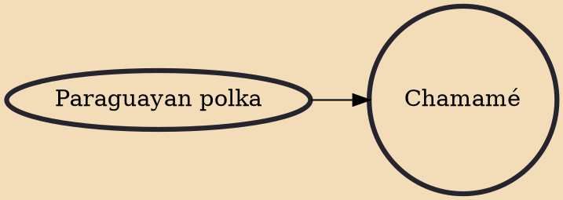

Chamamé (Guarani for: party, disorder) is a folk music genre from Northeast Argentina and Argentinian Mesopotamia. In 2020, Chamamé was inscribed in UNESCO's Intangible cultural heritage list after it was nominated by Argentina in 2018. Chamamé is also a traditional musical style appreciated in borders zone of South America, as Paraguay, Uruguay and Brazil, mainly in the South Region of Brazil (Rio Grande do Sul, Santa Catarina and Paraná) and Mato Grosso do Sul. Among chamamé figures of note are Teresa Parodi, Tránsito Cocomarola and Chango Spasiuk.

## Influences

- [[Paraguayan polka]]
