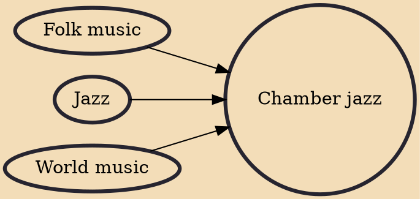

Chamber jazz is a genre of jazz involving small, acoustic-based ensembles where group interplay is important. It is influenced aesthetically by the small ensembles of chamber music in musical neoclassicism and is often influenced by classical forms of Western music as well as non-Western music or culture. That stated, in many cases the influence is traditional Celtic music, Central European folk music, or Latin American music instead.

## Influences
- [[Folk music]]
- [[Jazz]]
- [[World music]]
